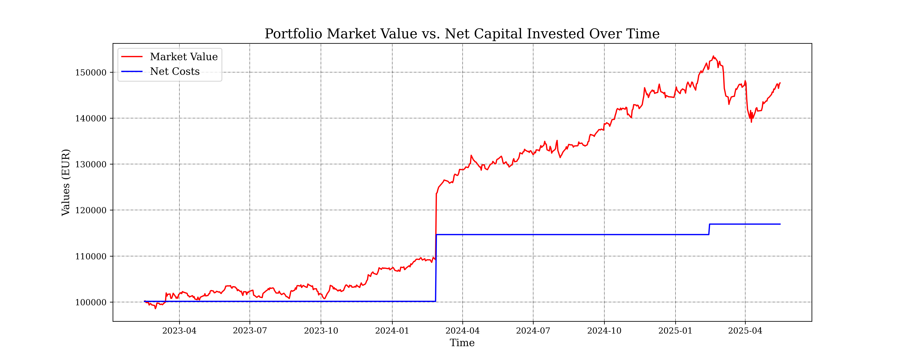

# 📈 Python Portfolio Tracker

A personal investment portfolio tracker built in Python using Jupyter Notebooks. This project monitors ETF and ETC investments over time, combining financial data ingestion, accounting, analysis, and visualization — all from raw transactions to performance charts.


## Technologies & Libraries

- **Python**
- **Jupyter Notebooks**
- `pandas`, `numpy`
- `matplotlib.pyplot`
- `yfinance` – for financial data fetching
- **LLMs Used:** ChatGPT & Gemini – assisted in optimizing functions, generating docstrings, and some explanation texts


## Features

- 📄 Load and parse personal transaction history
- 💰 Track invested capital over time for each asset
- 📊 Visualize asset price evolution and market value
- 📈 Generate consistent performance charts with `plot_timeseries()`
- 🧮 Analyze both individual asset and full portfolio performance
- 📂 Modular notebook-to-script workflow for flexibility


## Project Structure

```text
python-portfolio-tracker/
│
├── data/                                 # Contains user transaction .xlsx and .csv
├── images/                               # Sample output plots and screenshots
│
├── notebooks/
│   ├── 01_ingest_transactions.ipynb          # Read and clean raw transaction data
│   ├── 02_portfolio_accounting.ipynb         # Track capital invested
│   ├── 03_asset_timeseries.ipynb             # Fetch asset price and value time series
│   ├── 04_portfolio_performance.ipynb        # Portfolio-wide performance metrics
│   ├── 05_individual_asset_performance.ipynb # Drill-down on single asset returns
│   ├── 06_putting_all_together.ipynb         # Full analysis example using utils.py
│   ├── utils.py                              # Reusable functions from previous notebooks
```

## Example Output

